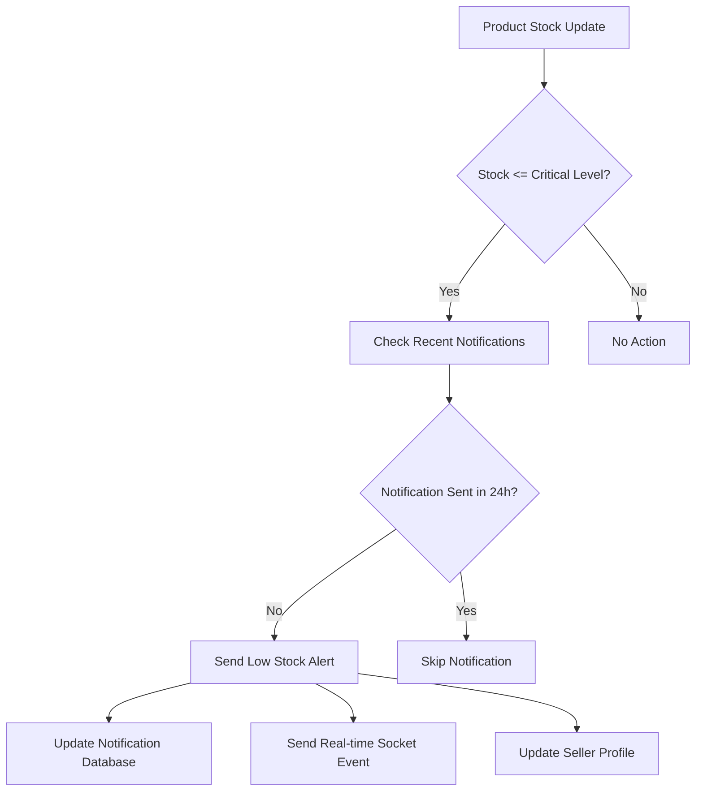

# Low Stock Alert System Documentation

## Overview

The Low Stock Alert System notifies sellers when their product inventory drops to critical levels based on their own defined thresholds. This helps sellers maintain adequate stock levels and avoid stockouts.

## Features

### 🚨 **Real-time Notifications**
- Automatic notifications when stock drops to or below critical levels
- Seller-defined critical stock threshands (lowStockAlert field)
- Prevents duplicate notifications within 24 hours
- Real-time socket-based notifications

### 📊 **Smart Alert Levels**
- **WARNING**: Stock at critical level (≤ lowStockAlert)
- **CRITICAL**: Stock at 50% of critical level (≤ lowStockAlert/2)
- Visual indicators with different colors and animations

### 🔔 **Multi-Channel Notifications**
- In-app notifications via notification system
- Real-time updates via WebSocket connections  
- Seller profile dashboard alerts
- Email notifications (can be extended)

## Implementation Details

### Database Schema

#### Product Model Extensions
```typescript
lowStockAlert: {
  type: Number,
  min: [0, 'Low stock alert cannot be negative'],
  default: 5
}
```

#### Notification Model Extensions
```typescript
type: 'low_stock_alert'
metadata: {
  productId: string,
  productName: string,
  currentStock: number,
  criticalLevel: number,
  unit: string,
  alertLevel: 'warning' | 'critical'
}
```

### Core Functions

#### 1. Low Stock Monitoring
```javascript
// lib/notification-utils.ts
export async function notifyLowStock(
  sellerId: string,
  productName: string, 
  productId: string,
  currentStock: number,
  criticalLevel: number,
  unit: string
): Promise<void>
```

#### 2. Inventory Checking
```javascript
// models/Product.ts
export async function checkLowStockAlerts(sellerId?: string): Promise<void>
```

#### 3. Scheduled Monitoring
```javascript
// scripts/check-low-stock.js
node scripts/check-low-stock.js
```

## Trigger Points

### 1. **Manual Stock Updates**
- When seller manually updates product stock
- Triggered in `/api/seller/products` PUT endpoint

### 2. **Order Processing** 
- After inventory reservation during order creation
- Triggered in `/api/orders/create` POST endpoint

### 3. **Scheduled Checks**
- Periodic monitoring via cron job
- Run `npm run check-low-stock`

### 4. **Profile Page Load**
- When seller visits their profile page
- Triggered in `/api/seller/low-stock-products` GET endpoint

## API Endpoints

### Get Low Stock Products
```
GET /api/seller/low-stock-products
```
Returns list of products below critical stock levels.

### Manual Alert Check
```
POST /api/inventory/check-alerts
```
Manually trigger low stock alert checking for all products.

## User Interface

### Seller Profile Dashboard
- **Alert Summary**: Shows count of low stock items
- **Product List**: Displays each low stock product with:
  - Product name and SKU
  - Current stock level
  - Critical threshold setting
  - Alert level (Warning/Critical)
  - Quick action buttons

### Alert Indicators
- **Orange Badge**: Warning level alerts
- **Red Badge**: Critical level alerts (animated)
- **Visual Icons**: Alert triangle icons with appropriate colors

## Configuration

### Setting Critical Levels
Sellers can set custom critical stock levels when:
1. Creating new products
2. Editing existing products
3. Default level is 5 units if not specified

### Notification Frequency
- **Cooldown Period**: 24 hours between duplicate alerts for same stock level
- **Real-time**: Immediate notifications for new stock drops
- **Batch Processing**: Scheduled checks for comprehensive monitoring

## Scheduled Monitoring

### Cron Job Setup
Add to your system cron or task scheduler:

```bash
# Check every hour during business hours
0 8-18 * * * cd /path/to/harvesthub && npm run check-low-stock

# Check every 4 hours outside business hours  
0 0,4,20 * * * cd /path/to/harvesthub && npm run check-low-stock
```

### Manual Execution
```bash
npm run check-low-stock
```

## Notification Flow



## Best Practices

### For Sellers
1. **Set Realistic Thresholds**: Consider lead times and sales velocity
2. **Monitor Regularly**: Check profile dashboard daily
3. **Act Quickly**: Restock when reaching warning levels
4. **Update Frequently**: Keep stock levels current

### For Administrators
1. **Monitor System Performance**: Watch notification volumes
2. **Adjust Frequencies**: Tune scheduling based on usage
3. **Database Maintenance**: Clean old notifications periodically
4. **Performance Optimization**: Index frequently queried fields

## Troubleshooting

### Common Issues

#### No Notifications Received
1. Check if `lowStockAlert` is set on products
2. Verify WebSocket connection is active
3. Check notification permissions

#### Duplicate Notifications
1. Verify 24-hour cooldown logic is working
2. Check database indexes on notification queries
3. Review recent alert timestamps

#### Performance Issues
1. Add database indexes on frequently queried fields:
   ```javascript
   db.products.createIndex({ "farmerId": 1, "stock": 1, "lowStockAlert": 1 })
   db.notifications.createIndex({ "userId": 1, "type": 1, "createdAt": -1 })
   ```

## Security Considerations

- **Data Privacy**: Only show seller their own product alerts
- **Rate Limiting**: Prevent notification spam
- **Input Validation**: Validate stock level updates
- **Access Control**: Secure API endpoints with proper authentication

## Future Enhancements

1. **Email Notifications**: Send email alerts for critical stock
2. **SMS Integration**: Text message alerts for urgent cases  
3. **Predictive Analytics**: Forecast when stock will run low
4. **Automatic Reordering**: Integration with supplier systems
5. **Mobile Push**: Native mobile app notifications
6. **Dashboard Analytics**: Stock performance metrics

## Monitoring & Metrics

### Key Metrics to Track
- Number of low stock alerts sent per day
- Average response time to restock after alert
- Stockout prevention rate
- Seller engagement with alerts

### Database Queries for Analytics
```javascript
// Most frequently low stock products
db.notifications.aggregate([
  { $match: { type: "low_stock_alert" }},
  { $group: { _id: "$metadata.productId", count: { $sum: 1 }}},
  { $sort: { count: -1 }}
])
```

## Support

For technical support or feature requests related to the Low Stock Alert System:
- Create an issue in the project repository
- Contact the development team
- Check the troubleshooting guide above

---

*Last updated: November 18, 2025*
*Version: 1.0*